# TouchDesigner X Chataigne

**Ou comment amener des couleurs et des valeurs en temps réel depuis Touchdesigner dans Chataigne.**

### Avant tout :

- Le [tuto introduction à Touchdesigner](https://github.com/LucieMrc/IntroTD) (EN).
- La [documentation officielle de Chataigne](https://bkuperberg.gitbook.io/chataigne-docs/v/fr/)
- Le [tuto introduction à Chataigne](https://github.com/LucieMrc/Chataigne_2spi) (🚧 en travaux 🚧).

## Exporter une couleur en temps réel

Dans Touchdesigner, on crée un `noise` TOP avec beaucoup de période, qui bouge lentement, avec peu d'harmoniques. On passe dans un `resolution` TOP pour avoir une image de 1 pixel par 1 pixel, le pixel central de l'image.

On crée un `TOP to` CHOP pour récuperer les valeurs R, G, B et A de l'image et on les envoie en OSC avec `OSC out`.

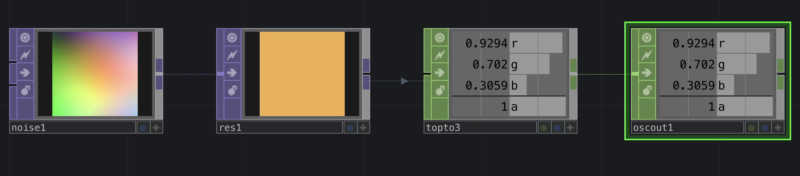

Dans Chataigne, on crée un module OSC dans le menu des modules en haut à gauche, et on met le même local port dans la partie `OSC Input` que dans Touchdesigner (par défaut : 10000).

Si on a le bon port, on voit les valeurs r, g, b, a et le sample rate.

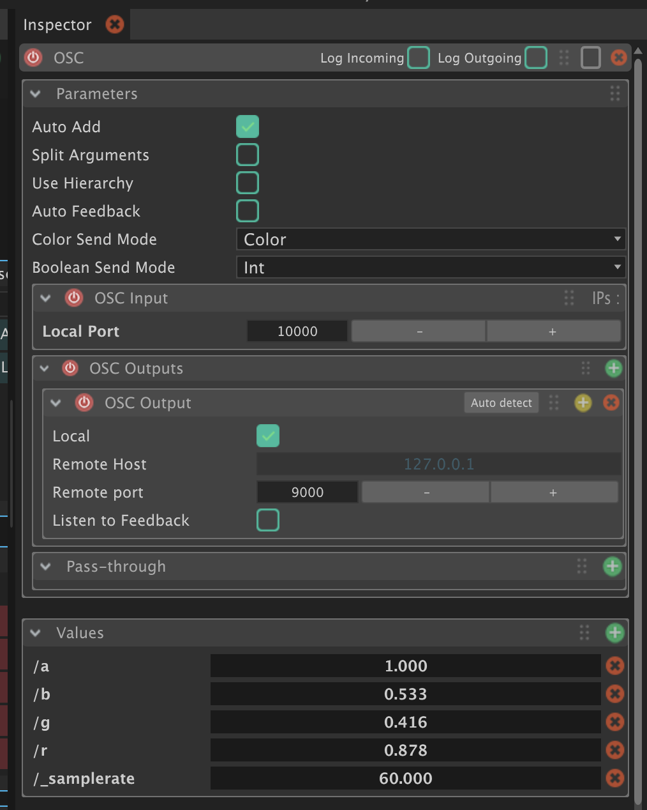

Pour assigner la couleur à des channels DMX, on crée un mapping dans la State Machine, et on crée un input pour R, G et B.

On crée ensuite un output `DMX`>`Set Color` et on peux entrer le numéro channel R de la fixture (sur des lights, le channel de la valeur de rouge est toujours suivi par celui de la valeur de vert puis la valeur de bleu).

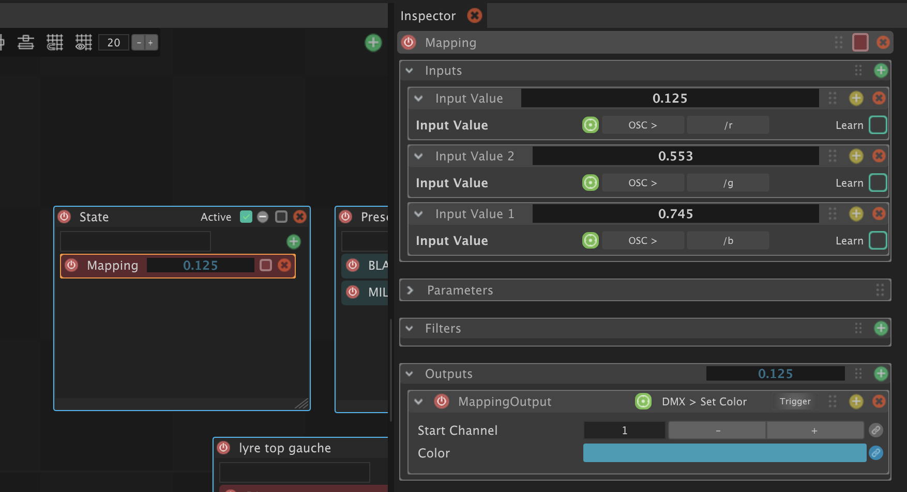

Si on clique sur le petit symbole lien 🔗 à gauche de la couleur, on voit que la couleur est calculée avec les trois valeurs reçues, R, G et B.

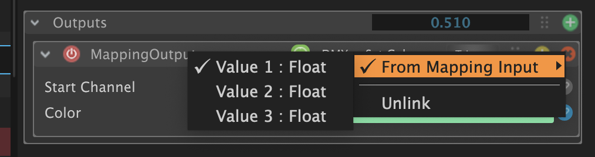

Interface de Touchdesigner + la couleur dans Chataigne :

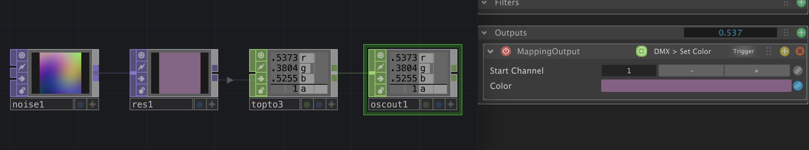

## Exporter une variable en temps réel

Dans Touchdesigner, on crée un noise qui change lentement avec absTime.seconds*20, et on l'envoie dans `Osc out`, en passant dans un `Select` CHOP pour l'associer aux données R, G, B et A que l'on envoie déjà.

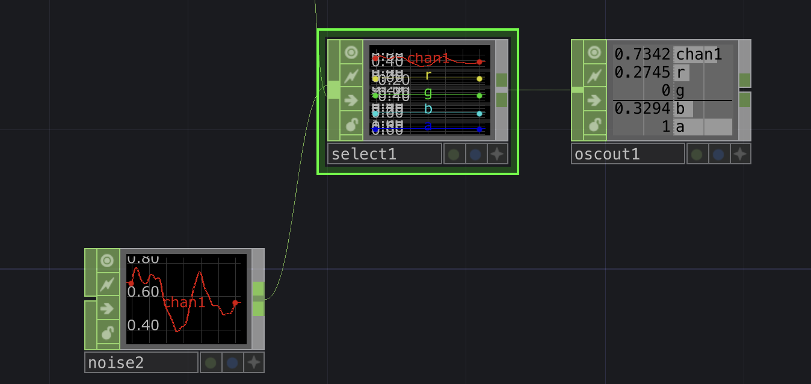

Dans Chataigne, on crée un nouveau mapping et dans l'input on récupère le nom de la variable que l'on vient de créer (ici chan1).

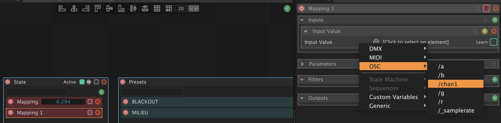

Le noise par défaut dans Touchdesigner est entre -0.5 et 0.5, donc on doit remapper la variable si on veux l'utiliser en DMX par exemple, entre 0 et 255.

Pour ça, il faut créer un nouveau filtre dans le mapping et choisir Remap > Remap.

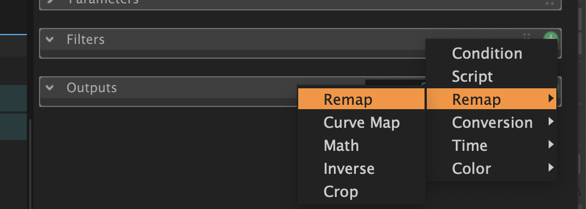

Ensuite, on mets -0.5 et 0.5 en Input Min/Max, et 0 et 255 en Target Min/Max.

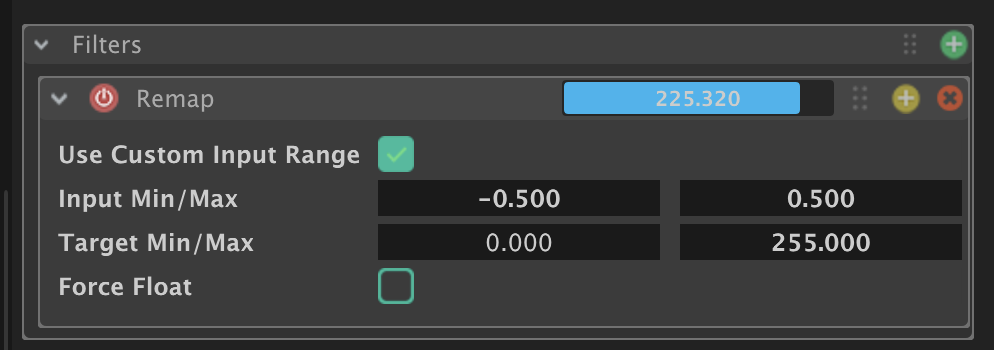

On peux maintenant se servir de cette variable pour contrôler un paramètre DMX.

## Enregistrer une courbe

Dans Touchdesigner, on crée un `Pattern` CHOP, et on met absTime.seconds en phase dans les paramètres. À nouveau, on l'envoie dans `Osc out`, en passant dans un `Select` CHOP pour l'associer aux données chan1, R, G, B et A que l'on envoie déjà.

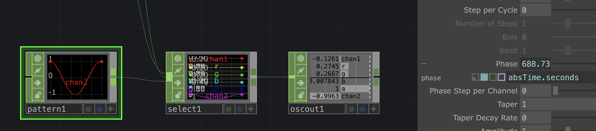

Dans Chataigne, on crée une nouvelle séquence et un Mapping dans cette séquence

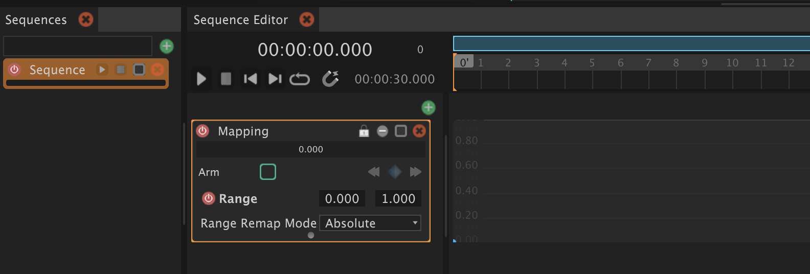

Dans l'inspecteur de ce mapping, on ouvre le menu `Recorder` et on choisit notre channel du pattern dans l'Input Value (ici chan2).

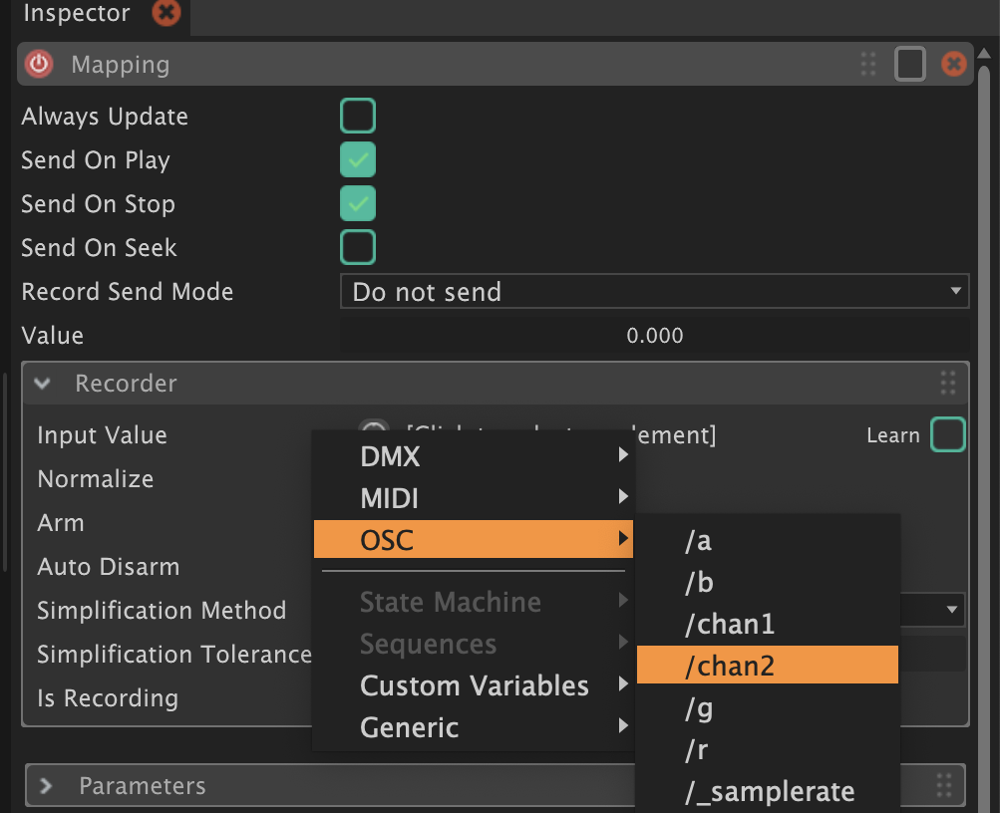

Dans le Mapping dans la timeline, on passe la range à celle du Pattern de Touchdesigner, -1 et 1, et on fait Range Remap Mode > Proportional, afin de pouvoir remapper la courbe après.

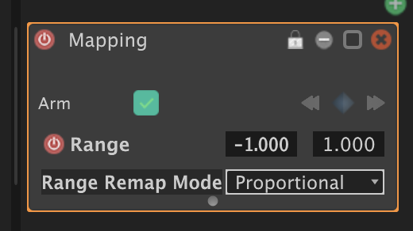

On clique sur `Arm` dans le Recorder ou directement dans le Mapping dans la timeline, et on lance la lecture de la timeline pour enregistrer la courbe.

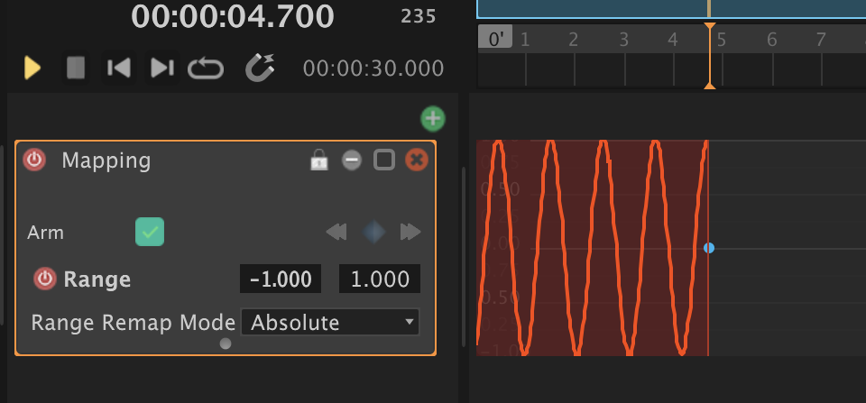

La courbe est rouge pendant son enregistrement, et devient une courbe avec des points éditables lorsqu'on met pause à la lecture de la timeline.

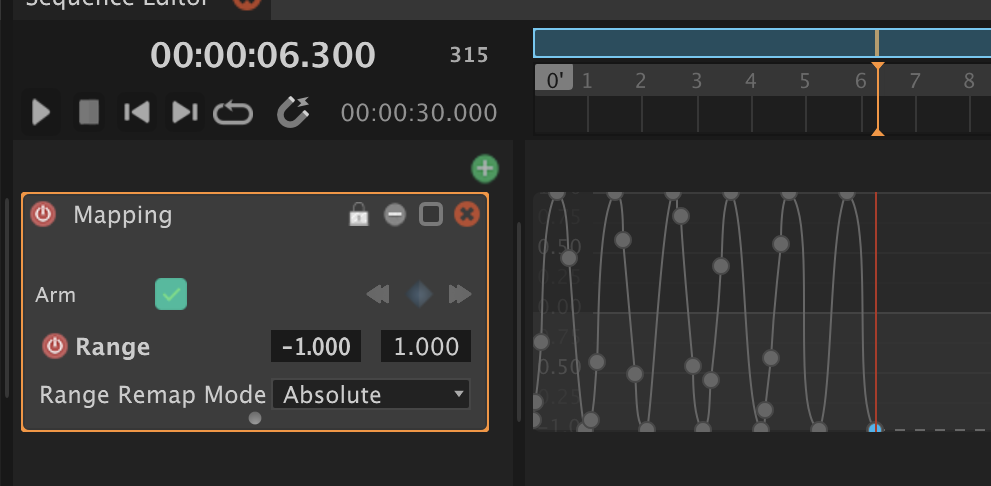

